# Software Design Document — Freelancer Subscription & QR Attendance Management System

## 1. Introduction / Overview

### 1.1 Project Summary

The system is a management platform for a workspace / freelancer subscription business. Members can subscribe to different plans such as hourly access, weekly hour bundles, monthly hour bundles, weekly unlimited access, or monthly unlimited access.

The core business problem is tracking member presence accurately using QR scanning, calculating used hours, deducting balances from hour-based plans, tracking payments, detecting abnormal sessions, and giving the admin a dashboard to manage corrections, members, payments, reports, and subscription rules.

The system must support:

- Admin dashboard for workspace management.
- Freelancer/member page to view subscription, remaining balance, current status, payments, and session history.
- QR-based check-in and check-out.
- Hour calculation with configurable rounding rules.
- Subscription/package management.
- Payment and unpaid amount tracking.
- Correction requests for forgotten check-out or wrong scan cases.
- Audit log for all manual changes.
- Reports and Excel export.
- Alerts for abnormal open sessions.
- Loyalty/reward rules.

---

## 2. Main Business Rules

### 2.1 Subscription Types

The system should support these default packages. All values must be editable from the dashboard settings/package management page.

| Package | Type | Default Behavior | Price |
|---|---|---|---|
| Hourly | Pay as you go | Member pays based on used hours | Configurable, default example: $0.50/hour |
| 20 Hours Weekly | Weekly hour bundle | 20 hours renewed weekly | Configurable |
| 50 Hours Monthly | Monthly hour bundle | 50 hours renewed monthly | Configurable |
| Weekly Unlimited | Weekly subscription | Unlimited access during active week, subject to max session rules | Configurable |
| Monthly Unlimited | Monthly subscription | Unlimited access during active month, subject to max session rules | Configurable |

### 2.2 QR Scan Design Decision

To avoid accidental double scans causing both check-in and check-out, the MVP should use **two QR codes**:

1. **Check-in QR**
2. **Check-out QR**

Each QR code contains a secure signed token with a purpose:

```text
purpose = check_in
purpose = check_out
```

This is safer than using one QR code that toggles status because one QR can accidentally open and close a session if scanned twice.

### 2.3 Session Rules

- A member can have only one open session at a time.
- A member cannot check in if:
  - Subscription is expired.
  - Hour balance is zero.
  - Member is inactive or blocked.
  - Member has unpaid amount above the configured allowed limit.
  - Member already has an open session.
- A member cannot check out if there is no open session.
- Every QR scan must be saved, even if rejected.
- Every successful check-in creates a new open session.
- Every successful check-out closes the active session and calculates usage.
- Manual session corrections must be logged in the audit log.

### 2.4 Time Calculation Rule

Default rounding rule based on the voice description:

- Rounding interval: **30 minutes**
- Rounding threshold: **15 minutes**
- Example:
  - 5:10 → counts as 5:00
  - 5:16 → counts as 5:30

This must be configurable from system settings.

### 2.5 Abnormal Open Session Rule

Default system settings:

| Setting | Default |
|---|---:|
| Open session review alert after | 14 hours |
| Max normal billable session hours | 8 hours |
| Auto-close abnormal session | Disabled by default |
| Admin notification enabled | Yes |

If a session remains open for more than the configured alert threshold, the system should:

1. Mark the session as `needs_review`.
2. Notify admin.
3. Show the session in “Sessions Needing Review”.
4. Allow admin to manually close/correct it.
5. Save the correction in audit logs.

The system should not silently deduct hours for abnormal sessions without admin review in MVP.

---

## 3. System Goals

### 3.1 Admin Goals

The admin should be able to:

- Create and manage members.
- Activate/deactivate members.
- Assign or change member packages.
- View who is currently inside.
- View open sessions.
- View sessions requiring review.
- Correct wrong sessions.
- Manage payments.
- Track unpaid amounts.
- Export reports to Excel.
- View daily/monthly revenue.
- View ending subscriptions.
- View active and inactive customers.
- Manage loyalty rules.
- Configure system defaults.

### 3.2 Freelancer / Member Goals

The member should be able to:

- View current subscription type.
- View current status: inside / outside.
- View remaining hour balance.
- View due amount.
- View paid/unpaid payment history.
- View subscription expiry date.
- View current/open session if any.
- View previous sessions.
- Submit correction request if a scan was forgotten or wrong.
- Receive notification when there is an issue or subscription is ending.

---

## 4. MVP Scope

### 4.1 MVP Features

The first version should include:

1. Member registration from dashboard.
2. Member activation/deactivation.
3. Package/subscription management.
4. QR check-in and check-out.
5. Session opening and closing.
6. Hour calculation.
7. Hour deduction for hour-based plans.
8. Unlimited package support.
9. Admin dashboard.
10. Freelancer/member page.
11. Payment records.
12. Unpaid amount tracking.
13. Correction requests.
14. Abnormal session detection after configured threshold.
15. Audit logs.
16. Excel export.
17. Basic reports.
18. System settings page.

### 4.2 Out of MVP

These can be delayed to later versions:

- Advanced loyalty automation.
- Birthday gift automation.
- Multi-branch advanced access control.
- Mobile app.
- Face recognition.
- Hardware turnstile integration.
- Automatic online payments.
- Complex accounting integrations.
- Advanced predictive analytics.

---

# 5. System Architecture

## 5.1 Recommended Architecture

The system should use a simple client-server architecture.

```text
Admin Dashboard / Member Portal
            ↓
        Backend API
            ↓
      Application Services
            ↓
        Database
            ↓
 Notifications / Reports / Exports
```

## 5.2 Main Applications

### Admin Dashboard

Used by system admins/managers to manage the full system.

Main modules:

- Dashboard overview
- Members
- Packages
- Subscriptions
- Sessions
- Payments
- Correction requests
- Reports
- Loyalty rules
- Settings
- Audit logs

### Member Portal

Used by freelancers/customers to see their own information.

Main modules:

- My subscription
- My current status
- My remaining balance
- My due amount
- My sessions
- My payments
- Submit correction request

### QR Scanner Page

Can be part of the member portal or a dedicated scan page.

The scanner sends:

```text
member_id
qr_token
scan_timestamp
device_info
location_id / office_area_id if needed
```

---

# 6. Data Design

## 6.1 Main Entities

### 6.1.1 Members Table

Stores freelancer/customer information.

Suggested fields:

```text
id
name
phone
email
qr_identifier
status: active / inactive / blocked
birth_date
notes
created_at
updated_at
deleted_at
```

Important constraints:

- Phone number should be unique.
- Email can be nullable but should be unique if provided.
- A blocked member cannot check in.
- A deleted member should not lose historical session/payment records.

---

### 6.1.2 Packages Table

Stores package definitions.

```text
id
name
type: hourly / hours_weekly / hours_monthly / unlimited_weekly / unlimited_monthly
duration_unit: hour / week / month
duration_value
included_hours
price
renewal_type: manual / automatic
is_active
settings_json
created_at
updated_at
```

Examples:

```text
Hourly
20 Hours Weekly
50 Hours Monthly
Weekly Unlimited
Monthly Unlimited
```

---

### 6.1.3 Member Subscriptions Table

Stores the active or historical package assigned to a member.

```text
id
member_id
package_id
status: active / expired / cancelled / paused
starts_at
ends_at
total_hours
remaining_hours
used_hours
price
paid_amount
due_amount
auto_renew
created_at
updated_at
```

Rules:

- A member can have one active subscription at a time.
- Historical subscriptions remain stored.
- Remaining hours are updated after session close for hour-based plans.
- Unlimited plans do not deduct hours but still track sessions.

---

### 6.1.4 Sessions Table

Stores check-in/check-out sessions.

```text
id
member_id
subscription_id
check_in_at
check_out_at
raw_duration_minutes
billable_duration_minutes
rounded_from_at
rounded_to_at
status: open / closed / needs_review / corrected / cancelled
check_in_scan_id
check_out_scan_id
correction_request_id
created_by
closed_by
notes
created_at
updated_at
```

Rules:

- Only one open session is allowed per member.
- `needs_review` sessions appear in admin dashboard.
- Corrected sessions must have audit logs.

---

### 6.1.5 QR Scan Events Table

Stores every QR scan attempt.

```text
id
member_id
qr_code_id
purpose: check_in / check_out
result: success / rejected / needs_review
failure_reason
scanned_at
ip_address
device_info
location_id
raw_payload
created_at
```

Examples of `failure_reason`:

```text
subscription_expired
no_remaining_hours
already_checked_in
no_open_session
member_blocked
unpaid_limit_exceeded
invalid_qr
```

---

### 6.1.6 QR Codes Table

Stores QR definitions.

```text
id
name
purpose: check_in / check_out
location_id
office_area_id
token_hash
is_active
expires_at
created_at
updated_at
```

For MVP, QR codes can be static but signed. Later, they can become rotating/dynamic QR codes.

---

### 6.1.7 Payments Table

Stores member payments.

```text
id
member_id
subscription_id
amount
currency
payment_method: cash / bank_transfer / card / other
status: paid / unpaid / partial / refunded / cancelled
paid_at
due_at
notes
created_by
created_at
updated_at
```

Payment rules:

- If subscription is created but not paid, system tracks due amount.
- Admin dashboard must show unpaid members.
- System setting controls whether unpaid members can still check in.

---

### 6.1.8 Correction Requests Table

Stores requests related to forgotten check-out, wrong check-in, or wrong duration.

```text
id
member_id
session_id
type: forgot_check_out / wrong_check_in / wrong_check_out / payment_issue / other
requested_check_in_at
requested_check_out_at
message
status: pending / approved / rejected
admin_note
reviewed_by
reviewed_at
created_at
updated_at
```

---

### 6.1.9 Audit Logs Table

Stores every sensitive admin/system change.

```text
id
actor_id
actor_type: admin / system
action
entity_type
entity_id
old_values_json
new_values_json
reason
ip_address
created_at
```

Must log:

- Manual session correction.
- Payment edit.
- Subscription change.
- Member status change.
- Package price change.
- System settings change.
- QR code change.

---

### 6.1.10 System Settings Table

Stores configurable business values.

```text
id
key
value
type: string / integer / decimal / boolean / json
group
description
is_public
created_at
updated_at
```

Default settings:

```text
hour_rounding_interval_minutes = 30
hour_rounding_threshold_minutes = 15
open_session_review_after_hours = 14
max_normal_billable_session_hours = 8
allow_check_in_with_due_amount = false
max_allowed_due_amount = 0
notify_admin_for_abnormal_sessions = true
notify_member_before_subscription_expiry_days = 2
default_currency = USD
auto_close_abnormal_sessions = false
```

---

### 6.1.11 Loyalty Rules Table

```text
id
name
trigger_type: total_hours / subscription_months / visit_count / birthday / manual
condition_json
reward_type: free_hours / gift / note / badge
reward_value
is_active
created_at
updated_at
```

Examples:

- If member uses more than 100 hours across two months, admin can reward free hours.
- If member stays subscribed for 6 months, admin can give a small gift.
- Birthday reminder for admin.

---

### 6.1.12 Rewards Table

```text
id
member_id
loyalty_rule_id
type: free_hours / gift / manual
value
status: pending / granted / cancelled
granted_at
notes
created_at
updated_at
```

---

## 6.2 Entity Relationship Summary

```text
Member 1----* MemberSubscription
Package 1----* MemberSubscription
Member 1----* Session
MemberSubscription 1----* Session
Member 1----* Payment
MemberSubscription 1----* Payment
Member 1----* CorrectionRequest
Session 1----* CorrectionRequest
Member 1----* QRScanEvent
QRCode 1----* QRScanEvent
Admin/System 1----* AuditLog
Member 1----* Reward
LoyaltyRule 1----* Reward
```

---

# 7. Component Design

## 7.1 Backend Components

### Auth Component

Responsibilities:

- Admin login.
- Member login.
- Session/token management.
- Role separation between admin and member.
- Protect APIs from unauthorized access.

---

### Member Management Component

Responsibilities:

- Create members.
- Update member data.
- Activate/deactivate/block members.
- Search members.
- View member profile.
- View member subscription, sessions, payments, corrections, rewards.

---

### Package Management Component

Responsibilities:

- Create package.
- Update package.
- Disable package.
- Configure pricing.
- Configure included hours and duration.
- Define if package is hourly, bundle, or unlimited.

---

### Subscription Component

Responsibilities:

- Assign package to member.
- Renew subscription.
- Cancel subscription.
- Track remaining hours.
- Track start/end dates.
- Detect expired subscriptions.
- Calculate due amount.

---

### QR Attendance Component

Responsibilities:

- Validate QR token.
- Validate scan purpose.
- Validate member eligibility.
- Create check-in session.
- Close check-out session.
- Store every scan event.
- Reject invalid scans with reason.

---

### Session Calculation Component

Responsibilities:

- Calculate raw duration.
- Apply rounding rules.
- Deduct hours from subscription.
- Mark abnormal sessions.
- Prevent duplicate open sessions.
- Support manual correction.

---

### Payment Component

Responsibilities:

- Record payments.
- Track paid/unpaid amounts.
- Attach payment to subscription.
- Show due amounts.
- Block or allow check-in based on settings.

---

### Correction Request Component

Responsibilities:

- Member submits correction request.
- Admin reviews correction.
- Admin approves/rejects.
- Approved correction updates session.
- System writes audit log.

---

### Reporting Component

Responsibilities:

- Daily revenue report.
- Monthly revenue report.
- Active members report.
- Inactive members report.
- Current inside members.
- Open sessions.
- Sessions needing review.
- Expiring subscriptions.
- Unpaid members.
- Export to Excel.

---

### Notification Component

Responsibilities:

- Notify admin about abnormal sessions.
- Notify admin about unpaid members.
- Notify member about expiring subscription.
- Notify member when correction request is approved/rejected.

---

### Settings Component

Responsibilities:

- Manage default system values.
- Manage rounding rules.
- Manage session review limits.
- Manage payment restrictions.
- Manage notification thresholds.
- Manage public/member-visible settings.

---

# 8. Interface Design

## 8.1 Admin Dashboard Pages

### Dashboard Home

Widgets:

- Members currently inside.
- Open sessions.
- Sessions needing review.
- Today revenue.
- Monthly revenue.
- Unpaid amount total.
- Expiring subscriptions.
- New members today.
- Active members.
- Inactive members.

### Members Page

Features:

- Search member.
- Filter by status.
- View member details.
- Edit member.
- Assign package.
- View sessions.
- View payments.
- View correction requests.
- View audit history.

### Sessions Page

Features:

- List sessions.
- Filter by open/closed/needs review.
- View session details.
- Manually close session.
- Correct check-in/check-out.
- Export sessions.

### Payments Page

Features:

- Add payment.
- Mark payment paid/unpaid/partial.
- Track due date.
- Filter unpaid members.
- Export payments.

### Packages Page

Features:

- Create/edit packages.
- Enable/disable packages.
- Configure price.
- Configure hours.
- Configure duration.

### Correction Requests Page

Features:

- View pending requests.
- Approve request.
- Reject request.
- Apply correction.
- Add admin note.

### Reports Page

Reports:

- Daily revenue.
- Weekly revenue.
- Monthly revenue.
- Used hours.
- Remaining hours.
- Subscription report.
- Active customers.
- Inactive customers.
- Payment report.
- Session correction report.

### Settings Page

Groups:

- Time calculation settings.
- QR settings.
- Payment settings.
- Notification settings.
- Loyalty settings.
- General system settings.

---

## 8.2 Member Portal Pages

### Member Dashboard

Shows:

- Subscription type.
- Current status: inside/outside.
- Remaining balance.
- Due amount.
- Paid amount.
- Expiry date.
- Current open session.
- Last session.
- Notifications.

### My Sessions

Shows:

- Check-in time.
- Check-out time.
- Duration.
- Billable duration.
- Status.
- Correction request option.

### My Payments

Shows:

- Paid payments.
- Unpaid payments.
- Due amount.
- Payment dates.

### Correction Request Form

Fields:

- Request type.
- Related session.
- Expected check-in/check-out time.
- Message.

---

# 9. API Design

## 9.1 Admin APIs

### Members

```text
GET    /api/admin/members
POST   /api/admin/members
GET    /api/admin/members/{id}
PUT    /api/admin/members/{id}
PATCH  /api/admin/members/{id}/status
GET    /api/admin/members/{id}/sessions
GET    /api/admin/members/{id}/payments
GET    /api/admin/members/{id}/subscriptions
```

### Packages

```text
GET    /api/admin/packages
POST   /api/admin/packages
GET    /api/admin/packages/{id}
PUT    /api/admin/packages/{id}
PATCH  /api/admin/packages/{id}/status
```

### Subscriptions

```text
POST   /api/admin/members/{id}/subscriptions
PUT    /api/admin/subscriptions/{id}
PATCH  /api/admin/subscriptions/{id}/cancel
PATCH  /api/admin/subscriptions/{id}/renew
```

### Sessions

```text
GET    /api/admin/sessions
GET    /api/admin/sessions/open
GET    /api/admin/sessions/needs-review
GET    /api/admin/sessions/{id}
PATCH  /api/admin/sessions/{id}/close
PATCH  /api/admin/sessions/{id}/correct
```

### Payments

```text
GET    /api/admin/payments
POST   /api/admin/payments
GET    /api/admin/payments/{id}
PUT    /api/admin/payments/{id}
PATCH  /api/admin/payments/{id}/mark-paid
```

### Correction Requests

```text
GET    /api/admin/correction-requests
GET    /api/admin/correction-requests/{id}
PATCH  /api/admin/correction-requests/{id}/approve
PATCH  /api/admin/correction-requests/{id}/reject
```

### Reports

```text
GET    /api/admin/reports/revenue
GET    /api/admin/reports/sessions
GET    /api/admin/reports/subscriptions
GET    /api/admin/reports/members
GET    /api/admin/reports/payments
GET    /api/admin/reports/export
```

### Settings

```text
GET    /api/admin/settings
PUT    /api/admin/settings
```

---

## 9.2 Member APIs

```text
GET    /api/member/profile
GET    /api/member/dashboard
GET    /api/member/subscription
GET    /api/member/sessions
GET    /api/member/payments
POST   /api/member/correction-requests
```

---

## 9.3 QR Scan API

```text
POST /api/qr/scan
```

Request:

```json
{
  "member_id": 15,
  "qr_token": "signed_qr_token",
  "scanned_at": "2026-05-31T17:10:00",
  "device_info": "Chrome / Android",
  "location_id": 1
}
```

Response examples:

Successful check-in:

```json
{
  "success": true,
  "action": "check_in",
  "message": "Check-in successful.",
  "data": {
    "session_id": 1001,
    "check_in_at": "2026-05-31T17:10:00",
    "member_status": "inside"
  }
}
```

Successful check-out:

```json
{
  "success": true,
  "action": "check_out",
  "message": "Check-out successful.",
  "data": {
    "session_id": 1001,
    "check_in_at": "2026-05-31T17:10:00",
    "check_out_at": "2026-05-31T19:16:00",
    "raw_duration_minutes": 126,
    "billable_duration_minutes": 120,
    "remaining_hours": 18
  }
}
```

Rejected scan:

```json
{
  "success": false,
  "message": "Member already has an open session.",
  "error_code": "already_checked_in"
}
```

---

# 10. DFD — Data Flow Diagram

## 10.1 Level 0 Context Diagram

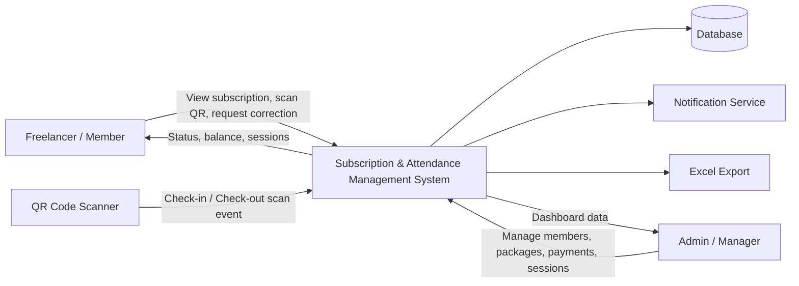

---

## 10.2 Level 1 DFD

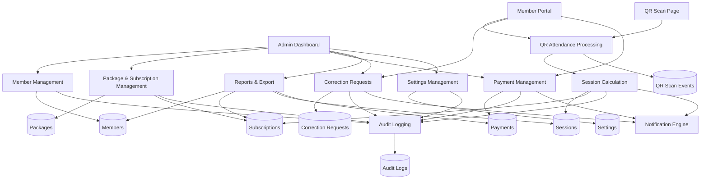

---

# 11. Component Diagram

```mermaid
flowchart TB
    subgraph ClientLayer[Client Layer]
        AdminUI[Admin Dashboard]
        MemberUI[Member Portal]
        QRUI[QR Scanner Page]
    end

    subgraph BackendLayer[Backend API Layer]
        AuthAPI[Auth API]
        MemberAPI[Member API]
        PackageAPI[Package API]
        SubscriptionAPI[Subscription API]
        QRAPI[QR Scan API]
        SessionAPI[Session API]
        PaymentAPI[Payment API]
        CorrectionAPI[Correction API]
        ReportAPI[Report API]
        SettingsAPI[Settings API]
    end

    subgraph DomainLayer[Domain Services]
        AuthService[Auth Service]
        MemberService[Member Service]
        PackageService[Package Service]
        SubscriptionService[Subscription Service]
        QRValidationService[QR Validation Service]
        AttendanceService[Attendance Service]
        SessionCalculationService[Session Calculation Service]
        PaymentService[Payment Service]
        CorrectionService[Correction Service]
        ReportService[Report Service]
        NotificationService[Notification Service]
        AuditLogService[Audit Log Service]
        SettingsService[Settings Service]
    end

    subgraph DataLayer[Data Layer]
        MembersDB[(Members)]
        PackagesDB[(Packages)]
        SubscriptionsDB[(Subscriptions)]
        SessionsDB[(Sessions)]
        ScanEventsDB[(QR Scan Events)]
        PaymentsDB[(Payments)]
        CorrectionsDB[(Correction Requests)]
        SettingsDB[(Settings)]
        AuditDB[(Audit Logs)]
    end

    AdminUI --> AuthAPI
    AdminUI --> MemberAPI
    AdminUI --> PackageAPI
    AdminUI --> SubscriptionAPI
    AdminUI --> SessionAPI
    AdminUI --> PaymentAPI
    AdminUI --> CorrectionAPI
    AdminUI --> ReportAPI
    AdminUI --> SettingsAPI

    MemberUI --> AuthAPI
    MemberUI --> MemberAPI
    MemberUI --> CorrectionAPI
    MemberUI --> PaymentAPI

    QRUI --> QRAPI

    AuthAPI --> AuthService
    MemberAPI --> MemberService
    PackageAPI --> PackageService
    SubscriptionAPI --> SubscriptionService
    QRAPI --> QRValidationService
    QRAPI --> AttendanceService
    SessionAPI --> AttendanceService
    SessionAPI --> SessionCalculationService
    PaymentAPI --> PaymentService
    CorrectionAPI --> CorrectionService
    ReportAPI --> ReportService
    SettingsAPI --> SettingsService

    MemberService --> MembersDB
    PackageService --> PackagesDB
    SubscriptionService --> SubscriptionsDB
    AttendanceService --> SessionsDB
    AttendanceService --> ScanEventsDB
    SessionCalculationService --> SessionsDB
    SessionCalculationService --> SubscriptionsDB
    PaymentService --> PaymentsDB
    CorrectionService --> CorrectionsDB
    SettingsService --> SettingsDB
    AuditLogService --> AuditDB

    AttendanceService --> NotificationService
    PaymentService --> NotificationService
    CorrectionService --> NotificationService

    MemberService --> AuditLogService
    PackageService --> AuditLogService
    SubscriptionService --> AuditLogService
    AttendanceService --> AuditLogService
    PaymentService --> AuditLogService
    CorrectionService --> AuditLogService
    SettingsService --> AuditLogService
```

---

# 12. Mermaid Sequence Diagrams

## 12.1 Check-In Flow

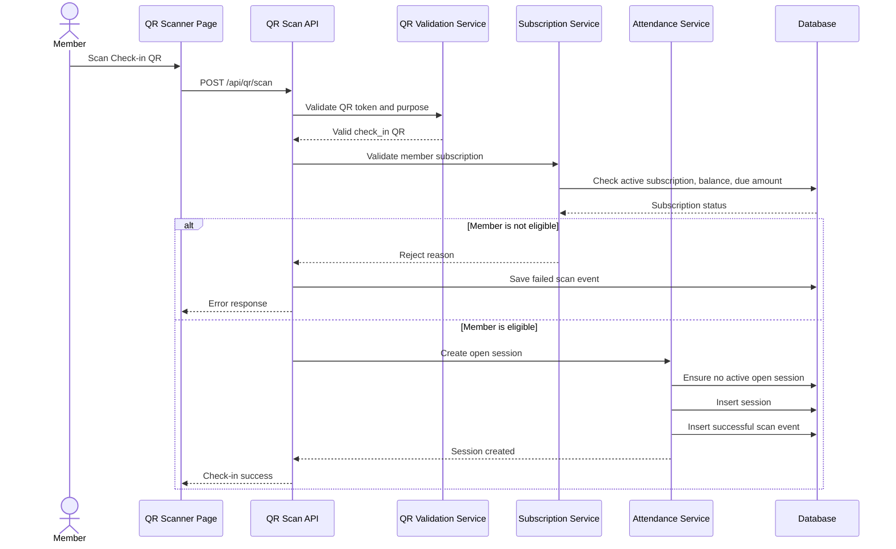

---

## 12.2 Check-Out Flow

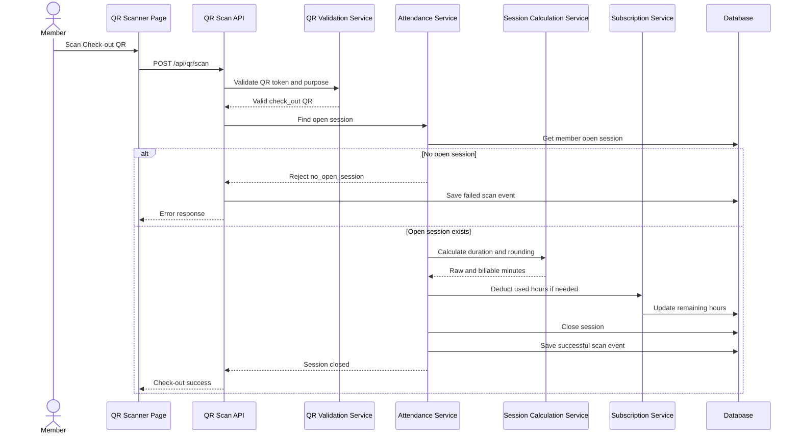

---

## 12.3 Abnormal Open Session Review Flow

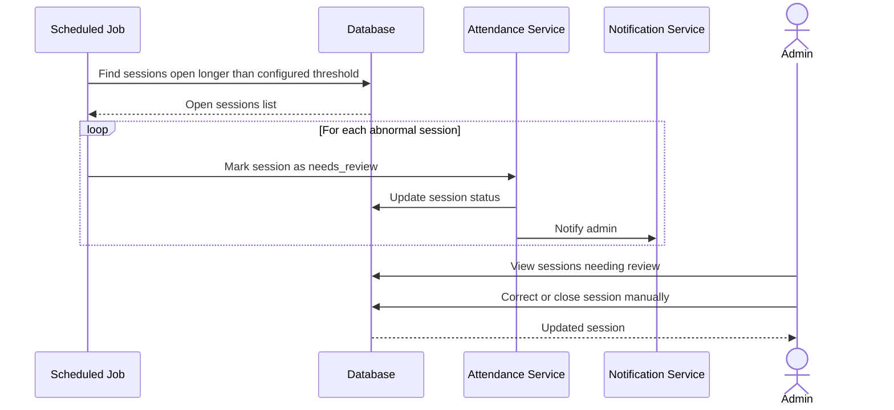

---

## 12.4 Correction Request Flow

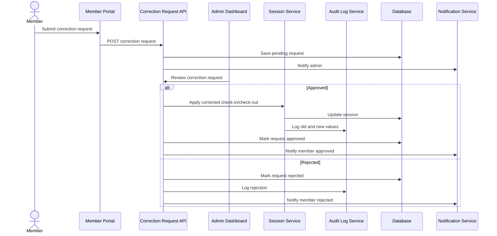

---

## 12.5 Payment and Subscription Assignment Flow

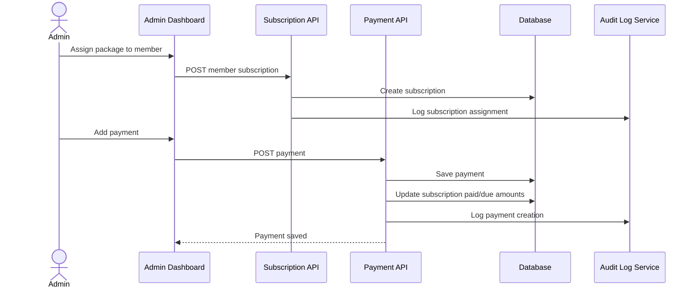

---

# 13. Key Dashboard Indicators

The dashboard should show:

| Indicator | Description |
|---|---|
| Members inside now | Members with open sessions |
| Open sessions | All sessions not checked out |
| Sessions needing review | Sessions open longer than configured threshold |
| Today revenue | Sum of today paid payments |
| Monthly revenue | Sum of current month paid payments |
| Unpaid amount | Total due amount |
| Expiring subscriptions | Subscriptions ending soon |
| Active members | Members with active subscription |
| Inactive members | Members without recent activity |
| New members today | Members created today |
| Most used packages | Packages with highest usage |
| Used hours today | Total billable hours today |
| Used hours this month | Total billable hours this month |

---

# 14. Settings Page Requirements

Because some numbers are unclear and may change, the dashboard must include a settings page.

## 14.1 Time Settings

```text
hour_rounding_interval_minutes
hour_rounding_threshold_minutes
open_session_review_after_hours
max_normal_billable_session_hours
auto_close_abnormal_sessions
```

## 14.2 Payment Settings

```text
allow_check_in_with_due_amount
max_allowed_due_amount
default_currency
payment_due_reminder_days
```

## 14.3 Subscription Settings

```text
subscription_expiry_warning_days
auto_renew_enabled
allow_multiple_active_subscriptions
```

Default:

```text
allow_multiple_active_subscriptions = false
```

## 14.4 QR Settings

```text
qr_token_expiry_days
allow_static_qr
require_location_validation
allow_same_device_multiple_scans
```

Default MVP:

```text
allow_static_qr = true
require_location_validation = false
```

## 14.5 Notification Settings

```text
notify_admin_abnormal_session
notify_admin_unpaid_member
notify_member_expiring_subscription
notify_member_correction_status
```

---

# 15. Security and Validation Rules

## 15.1 Member Rules

- Phone number must be unique.
- Member cannot have more than one open session.
- Member cannot check in with expired subscription.
- Member cannot check in with zero remaining hours unless package is unlimited.
- Member cannot check in if blocked.
- Member cannot check in if due amount exceeds configured limit.

## 15.2 QR Rules

- QR token must be signed.
- QR code must have purpose: check_in or check_out.
- Inactive QR code must be rejected.
- Every scan attempt must be stored.
- Failed scan attempts must include reason.

## 15.3 Session Rules

- Open session cannot be duplicated.
- Closed session cannot be closed again.
- Corrected session must store old and new values.
- Abnormal sessions must require admin review.

## 15.4 Payment Rules

- Payment edits must be audited.
- Partial payments are allowed.
- Due amount must be visible in admin and member dashboard.
- Admin can manually mark payment as paid.

---

# 16. Reports

## 16.1 Daily Reports

- Daily revenue.
- Daily sessions.
- Daily used hours.
- Daily new members.
- Daily correction requests.

## 16.2 Weekly Reports

- Weekly revenue.
- Weekly package usage.
- Weekly member activity.
- Weekly unpaid members.

## 16.3 Monthly Reports

- Monthly revenue.
- Monthly active members.
- Monthly inactive members.
- Monthly total used hours.
- Monthly subscription renewals.
- Monthly expired subscriptions.

## 16.4 Export Requirements

All major lists should support Excel export:

- Members
- Sessions
- Payments
- Subscriptions
- Correction requests
- Audit logs
- Revenue reports
- Usage reports

---

# 17. Recommended Status Enums

## 17.1 Member Status

```text
active
inactive
blocked
deleted
```

## 17.2 Subscription Status

```text
active
expired
cancelled
paused
```

## 17.3 Session Status

```text
open
closed
needs_review
corrected
cancelled
```

## 17.4 Payment Status

```text
paid
unpaid
partial
refunded
cancelled
```

## 17.5 Correction Request Status

```text
pending
approved
rejected
```

## 17.6 QR Scan Result

```text
success
rejected
needs_review
```

---

# 18. MVP Implementation Notes

## 18.1 Recommended First Version Priority

Phase 1:

- Members
- Packages
- Subscriptions
- QR check-in/check-out
- Sessions
- Basic dashboard
- Settings

Phase 2:

- Payments
- Due amounts
- Correction requests
- Audit logs
- Reports
- Excel export

Phase 3:

- Loyalty rules
- Notifications
- Advanced analytics
- Member portal improvements

## 18.2 Important Technical Notes

- Do not calculate session duration only on the frontend.
- Backend must be the source of truth for time calculation.
- Store raw scan time and rounded billable time separately.
- Do not delete sessions after correction.
- Always keep historical records.
- Use audit logs for any admin change that affects money, time, subscription, or attendance.
- Keep package prices and settings editable from dashboard.
- Use separate QR codes for check-in and check-out in MVP.
- Do not auto-deduct abnormal sessions without review.

---

# 19. Final MVP Summary

The MVP is a QR-based subscription and attendance management system for freelancers/workspace members.

The system allows admin to manage members, packages, subscriptions, sessions, payments, corrections, reports, and settings. Members can view their subscription, current status, remaining balance, due amount, sessions, and submit correction requests.

The most important logic is:

1. Member scans check-in QR.
2. System validates subscription/payment/status.
3. System opens session.
4. Member scans check-out QR.
5. System calculates rounded billable time.
6. System deducts hours if package is hour-based.
7. System tracks payment/due amount.
8. System flags abnormal sessions.
9. Admin can correct sessions with full audit logs.

The system must keep all unclear numbers configurable from the dashboard settings page.

---

## Backend Decision Note

The strongest backend decision here is to make **sessions immutable by default** and apply changes through correction records + audit logs, because this system directly affects money and billable hours.


---

# Filament Dashboard Implementation Update

This section updates the original SDD to match a Laravel + Filament dashboard implementation. The backend should be designed as a Laravel domain layer with Filament Resources, Pages, Widgets, Actions, and Relation Managers on top of it.

## 20. Filament-Based Architecture

### 20.1 Updated Architecture Decision

The system will be implemented mainly as a **Filament admin dashboard** inside a Laravel project. Instead of building a separate custom admin frontend, the dashboard UI should be mapped directly to Filament components.

Recommended structure:

```text
Laravel Application
├── App\Models
├── App\Services
├── App\Actions
├── App\Enums
├── App\Filament\Resources
├── App\Filament\Pages
├── App\Filament\Widgets
├── App\Filament\RelationManagers
├── App\Notifications
├── App\Jobs
└── App\Policies
```

### 20.2 Important Filament Design Rule

Filament should not contain the full business logic directly inside Resources or Pages. Filament classes should mainly handle:

- Forms
- Tables
- Filters
- Actions
- Validation display
- Navigation
- Relation managers
- Dashboard widgets

Core logic should stay inside services/actions, for example:

```text
AttendanceService
SubscriptionService
PaymentService
SessionCorrectionService
ReportService
SettingsService
LoyaltyService
```

This makes the system easier to test, reuse, and extend later if a member portal or API is added.

---

# 21. Filament Panel Structure

## 21.1 Admin Panel

Default path:

```text
/admin
```

The Admin Panel is used by owners/managers to manage the full system.

Main navigation groups:

```text
Dashboard
Members Management
Attendance & Sessions
Subscriptions & Packages
Payments & Accounting
Correction Requests
Reports
Loyalty
System Settings
Audit Logs
```

## 21.2 Optional Member Panel

If the freelancer/member page will also be built with Filament, create a second Filament panel:

```text
/member
```

The Member Panel should be read-only for most data and only allow the member to:

- View current subscription
- View remaining hours
- View due amount
- View sessions
- Submit correction request
- View payment history
- See current inside/outside status

If you do not want a member Filament panel, the member side can be a normal Laravel/Blade page or API later.

---

# 22. Filament Resources Mapping

## 22.1 MemberResource

Model:

```text
Member
```

Purpose:

Manage freelancers/customers.

Filament features:

- Table with searchable name, phone, email, status, current subscription, inside/outside status.
- Filters by status, subscription type, unpaid amount, inside now, inactive.
- Actions:
  - View member
  - Edit member
  - Activate
  - Deactivate
  - Block
  - Assign package
  - Add payment
  - Manual check-out
  - Create correction request

Recommended relation managers:

```text
SubscriptionsRelationManager
SessionsRelationManager
PaymentsRelationManager
CorrectionRequestsRelationManager
RewardsRelationManager
AuditLogsRelationManager
```

Important table columns:

```text
name
phone
status
current_subscription
remaining_hours
current_session_status
due_amount
subscription_ends_at
created_at
```

---

## 22.2 PackageResource

Model:

```text
Package
```

Purpose:

Manage subscription plans.

Actions:

- Create package
- Edit package
- Enable/disable package
- Duplicate package

Fields:

```text
name
type
price
included_hours
duration_unit
duration_value
renewal_type
is_active
settings_json
```

Package types:

```text
hourly
hours_weekly
hours_monthly
unlimited_weekly
unlimited_monthly
```

---

## 22.3 MemberSubscriptionResource

Model:

```text
MemberSubscription
```

Purpose:

Track assigned packages and active subscription records.

Actions:

- Renew subscription
- Cancel subscription
- Pause subscription
- Add hours
- Mark expired
- Record payment

Important filters:

```text
active
expired
ending_soon
unpaid
hour_based
unlimited
```

---

## 22.4 SessionResource

Model:

```text
Session
```

Purpose:

Manage attendance sessions.

Actions:

- View session
- Close session manually
- Correct check-in/check-out
- Mark as needs review
- Cancel invalid session
- Export sessions

Important filters:

```text
open
closed
needs_review
corrected
cancelled
today
this_week
this_month
```

Important table columns:

```text
member
check_in_at
check_out_at
raw_duration_minutes
billable_duration_minutes
status
remaining_hours_after_session
created_at
```

Special Filament Action:

```text
CorrectSessionAction
```

This action should open a modal where admin enters:

```text
corrected_check_in_at
corrected_check_out_at
reason
admin_note
```

After submit:

1. Recalculate billable time.
2. Update subscription balance if needed.
3. Save old values and new values in audit log.
4. Mark session as corrected.

---

## 22.5 PaymentResource

Model:

```text
Payment
```

Purpose:

Manage payments and due amounts.

Actions:

- Add payment
- Edit payment
- Mark as paid
- Mark as partial
- Refund/cancel payment
- Export payments

Filters:

```text
paid
unpaid
partial
today
this_month
due_this_week
```

---

## 22.6 CorrectionRequestResource

Model:

```text
CorrectionRequest
```

Purpose:

Manage forgotten check-outs and wrong scan requests.

Actions:

- Approve
- Reject
- Apply correction
- Add admin note

Statuses:

```text
pending
approved
rejected
```

When approved, the action should call:

```text
SessionCorrectionService::approveCorrectionRequest($request, $admin)
```

---

## 22.7 QRCodeResource

Model:

```text
QRCode
```

Purpose:

Manage check-in and check-out QR codes.

Fields:

```text
name
purpose
location_id
office_area_id
token_hash
is_active
expires_at
```

Actions:

- Generate check-in QR
- Generate check-out QR
- Regenerate token
- Disable QR
- Print QR

Default QR codes:

```text
Main Entrance Check-in QR
Main Entrance Check-out QR
```

---

## 22.8 QRScanEventResource

Model:

```text
QRScanEvent
```

Purpose:

Read-only log for every QR scan attempt.

This resource should usually be read-only.

Filters:

```text
success
rejected
needs_review
invalid_qr
already_checked_in
no_open_session
subscription_expired
no_remaining_hours
```

---

## 22.9 SystemSettingResource or Settings Page

For settings, prefer a custom Filament Page instead of a normal Resource if settings are stored as key/value records.

Page:

```text
SystemSettingsPage
```

Groups:

```text
Time Calculation Settings
QR Settings
Payment Settings
Subscription Settings
Notification Settings
Loyalty Settings
General Settings
```

Default editable values:

```text
hour_rounding_interval_minutes = 30
hour_rounding_threshold_minutes = 15
open_session_review_after_hours = 14
max_normal_billable_session_hours = 8
allow_check_in_with_due_amount = false
max_allowed_due_amount = 0
notify_admin_for_abnormal_sessions = true
notify_member_before_subscription_expiry_days = 2
default_currency = USD
auto_close_abnormal_sessions = false
```

---

## 22.10 AuditLogResource

Model:

```text
AuditLog
```

Purpose:

Show all sensitive changes.

Recommended behavior:

- Read-only.
- Not editable.
- Filterable by actor, action, entity type, and date.

Important events:

```text
member_status_changed
subscription_assigned
subscription_cancelled
payment_created
payment_updated
session_corrected
session_closed_manually
settings_updated
qr_code_regenerated
```

---

# 23. Filament Dashboard Widgets

## 23.1 Main Dashboard Widgets

Use Filament widgets for dashboard KPIs.

Recommended widgets:

```text
MembersInsideNowWidget
OpenSessionsWidget
SessionsNeedReviewWidget
TodayRevenueWidget
MonthlyRevenueWidget
UnpaidAmountWidget
ExpiringSubscriptionsWidget
ActiveMembersWidget
InactiveMembersWidget
UsedHoursTodayWidget
UsedHoursThisMonthWidget
```

## 23.2 Dashboard Tables

Recommended dashboard table widgets:

```text
CurrentlyInsideMembersTable
SessionsNeedingReviewTable
UnpaidMembersTable
ExpiringSubscriptionsTable
RecentPaymentsTable
RecentCorrectionRequestsTable
```

## 23.3 Dashboard Charts

Recommended chart widgets:

```text
RevenueChartWidget
SessionHoursChartWidget
PackageUsageChartWidget
MemberActivityChartWidget
```

---

# 24. Updated Filament Logic Flow

## 24.1 Admin-First Logic

Because the system is implemented in Filament, the admin should not need a separate frontend for management. Most operations happen through:

```text
Filament Resource Table Actions
Filament Resource Header Actions
Filament Relation Managers
Filament Custom Pages
Filament Widgets
```

Examples:

- Assigning a package happens from `MemberResource` action or relation manager.
- Viewing member sessions happens inside `MemberResource` relation manager.
- Correcting a session happens from `SessionResource` table action.
- Reviewing correction requests happens from `CorrectionRequestResource`.
- Editing rounding rules happens from `SystemSettingsPage`.

## 24.2 Service-Layer Logic

Do not put calculations directly inside Filament actions. Actions should call service classes.

Example:

```text
Filament Action: Close Session
        ↓
AttendanceService::closeSession()
        ↓
SessionCalculationService::calculateBillableDuration()
        ↓
SubscriptionService::deductHours()
        ↓
AuditLogService::log()
```

---

# 25. Updated User Flow Diagrams

## 25.1 Admin Creates Member and Assigns Package

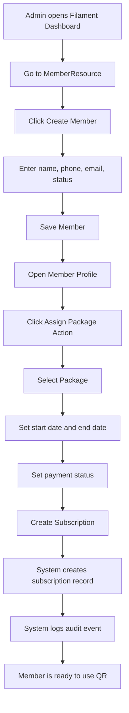

---

## 25.2 Member Check-In Using QR

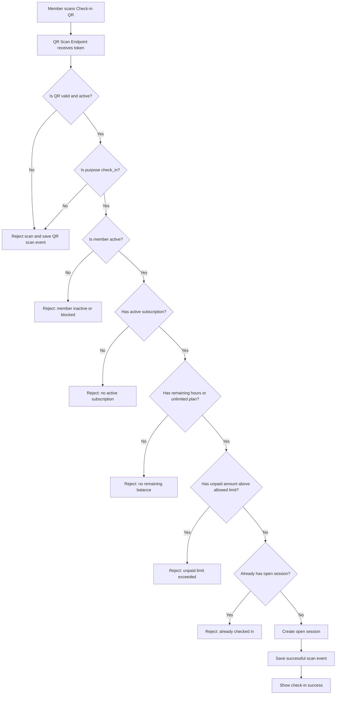

---

## 25.3 Member Check-Out Using QR

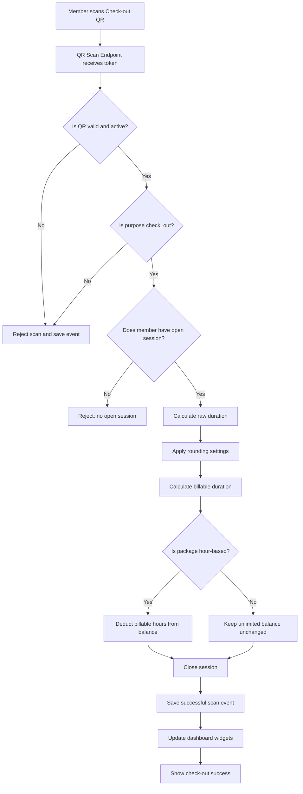

---

## 25.4 Admin Corrects a Session from Filament

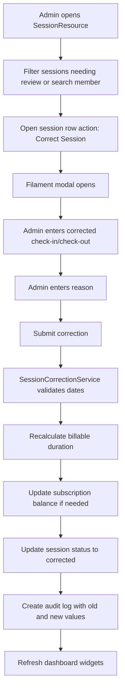

---

## 25.5 Admin Reviews Correction Request

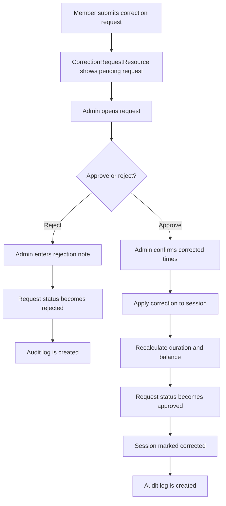

---

## 25.6 Admin Records Payment

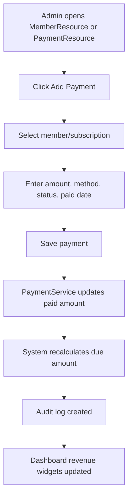

---

## 25.7 Admin Updates System Settings

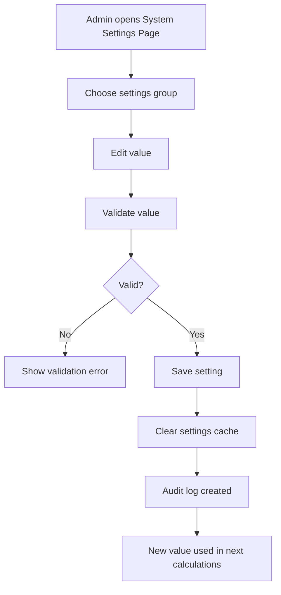

---

## 25.8 Scheduled Job Detects Abnormal Sessions

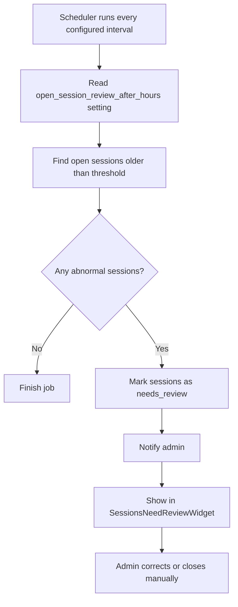

---

# 26. Filament Navigation Design

Recommended navigation:

```text
Dashboard
├── Overview

Members Management
├── Members
├── Active Members
├── Inactive Members

Attendance & Sessions
├── Sessions
├── Open Sessions
├── Sessions Needing Review
├── QR Codes
├── QR Scan Events

Subscriptions & Packages
├── Packages
├── Subscriptions
├── Expiring Subscriptions

Payments & Accounting
├── Payments
├── Unpaid Members
├── Revenue Reports

Correction Requests
├── Pending Requests
├── Approved Requests
├── Rejected Requests

Reports
├── Daily Report
├── Weekly Report
├── Monthly Report
├── Export Center

Loyalty
├── Loyalty Rules
├── Rewards

System
├── Settings
├── Audit Logs
```

---

# 27. Filament Actions List

## 27.1 Member Actions

```text
ActivateMemberAction
DeactivateMemberAction
BlockMemberAction
AssignPackageAction
AddPaymentAction
ManualCheckOutAction
CreateCorrectionRequestAction
```

## 27.2 Session Actions

```text
CloseSessionAction
CorrectSessionAction
CancelSessionAction
MarkNeedsReviewAction
ExportSessionsAction
```

## 27.3 Subscription Actions

```text
RenewSubscriptionAction
CancelSubscriptionAction
PauseSubscriptionAction
AddHoursAction
MarkExpiredAction
```

## 27.4 Payment Actions

```text
MarkPaymentPaidAction
MarkPaymentPartialAction
CancelPaymentAction
RefundPaymentAction
```

## 27.5 Correction Request Actions

```text
ApproveCorrectionRequestAction
RejectCorrectionRequestAction
ApplyCorrectionAction
```

## 27.6 QR Code Actions

```text
GenerateQRCodeAction
RegenerateQRCodeTokenAction
DisableQRCodeAction
PrintQRCodeAction
```

---

# 28. Updated Implementation Notes for Laravel + Filament

## 28.1 Recommended Classes

```text
app/Services/AttendanceService.php
app/Services/SessionCalculationService.php
app/Services/SubscriptionService.php
app/Services/PaymentService.php
app/Services/SessionCorrectionService.php
app/Services/SettingsService.php
app/Services/AuditLogService.php
app/Services/ReportService.php
```

## 28.2 Recommended Enums

```text
MemberStatus
PackageType
SubscriptionStatus
SessionStatus
PaymentStatus
CorrectionRequestStatus
QRCodePurpose
QRScanResult
```

## 28.3 Recommended Jobs

```text
DetectAbnormalOpenSessionsJob
ExpireSubscriptionsJob
NotifyExpiringSubscriptionsJob
GenerateDailyReportSnapshotJob
```

## 28.4 Recommended Notifications

```text
AbnormalSessionDetectedNotification
SubscriptionExpiringNotification
CorrectionRequestStatusNotification
PaymentDueNotification
```

---

# 29. Updated Final System Logic

The system should now be understood as a Laravel backend with Filament as the main admin interface.

The core logic remains the same, but the implementation changes:

- Admin operations are done through Filament Resources and Actions.
- Dashboard statistics are done through Filament Widgets.
- Member details are organized using Relation Managers.
- System configuration is managed through a Filament Settings Page.
- Session correction is handled through Filament modal actions.
- Business logic is placed in service/action classes, not directly inside Filament UI classes.
- Audit logs are mandatory for all changes that affect money, hours, subscriptions, or attendance.

The MVP should focus on clean Filament resources, strong service-layer logic, and clear user flows rather than building a separate dashboard frontend.
